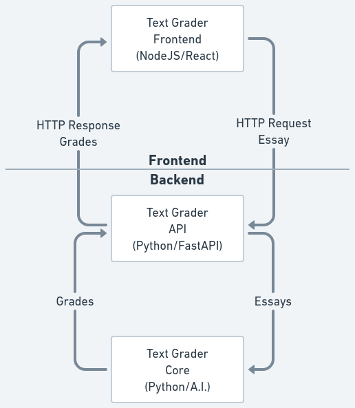

<h1 align="center">
  Text Grader
</h1>

<h4 align="center">Text Grader - A system for automatic evaluation of essays</h4>

<p align="center">
  <a href="#about">About</a> •
  <a href="#usage">Usage</a> •
  <a href="#development">Development</a> •
  <a href="#credits">Credits</a> •
  <a href="#license">License</a>
</p>


## About

This repository contains TextGrader. In essence textgrader contains the various versions of a Essay and short answer evaluation system.

The system is divided as explained below:



1. Frontend (NodeJS)
   1. [Text Grader Website](/frontend)
      1. Show an User Interface with a Text Editor and a button to grade the text
      2. Send the text in a HTTP GET request body to Text Grader API
      3. Receive the HTTP response and show it to the user
2. Backend (Python)
   1. [Text Grader API](/backend/api)
      1. Receive a HTTP get request with a text content
      2. Run and send the data to Text Grader Core
      3. Receive the response from Text Grader Core
      4. Transform the data in JSON and send the HTTP response
   2. [Text Grader Core](/backend/core)
      1. Preprocessing where we correct spelling change columns schema and do other minor preprocessing steps
      2. Feature engineering, where we generate some basic features like word count and sentence count, and generate datasets embedding words with each one of the following 4 techniques: TF-IDF, WORD-2-VEC, USE, LSI.
      3. Model training, where we train some instances of a random forest model using one of the following 3 approaches: Regression, Classification and Ordinal Classification.
      4. Model Evaluation, where we use the trained models to generate predictions and evaluate those predictions.

## Usage

Run in your terminal ``docker compose up -d``. You can access from your browser:

1. [Text Grader API Docs](http://localhost:8000/docs) - http://localhost:8000/docs
2. [Text Grader Website](http://localhost:3000/) - http://localhost:3000/

## Development

This project uses [GitFlow](http://danielkummer.github.io/git-flow-cheatsheet/) workflow:

- Start your new feature: Make a new branch based on develop branch
- Finish your feature: Open a Pull request from your feature branch to develop

This project also uses [Semantic Commit Messages](https://gist.github.com/joshbuchea/6f47e86d2510bce28f8e7f42ae84c716):

See how a minor change to your commit message style can make you a better programmer.

Format: `<type>(<scope>): <subject>`

`<scope>` is optional

### Example

```
feat: add hat wobble
^--^  ^------------^
|     |
|     +-> Summary in present tense.
|
+-------> Type: chore, docs, feat, fix, refactor, style, or test.
```

More Examples:

- `feat`: (new feature for the user, not a new feature for build script)
- `fix`: (bug fix for the user, not a fix to a build script)
- `docs`: (changes to the documentation)
- `style`: (formatting, missing semi colons, etc; no production code change)
- `refactor`: (refactoring production code, eg. renaming a variable)
- `test`: (adding missing tests, refactoring tests; no production code change)
- `chore`: (updating grunt tasks etc; no production code change)

References:

- https://www.conventionalcommits.org/
- https://seesparkbox.com/foundry/semantic_commit_messages
- http://karma-runner.github.io/1.0/dev/git-commit-msg.html

## Credits

Thanks for the open source projects bellow:

- [Docker](https://github.com/docker)
- [NodeJS](https://github.com/nodejs)
- [Python](https://github.com/python)

## License

MIT
